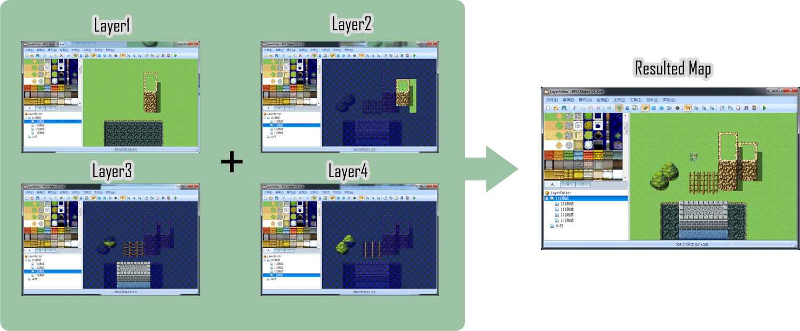

# RMVA Layered Map Editor

## Introduction

This is editor for RPG Maker VX Ace to edit the maps in layers.

The motivation is that RMVA editor removed the ability to edit map layers while the data structure still have layers, which makes it a pain in the ass to draw the map in certain ways.

The idea of this editor, which is actually a module in script, is to use three maps to represent three layers in the resulted map. This makes some interesting tile compositions possible.

The resulted map is safe to transfer to any RPG Maker VX Ace project without the support of this module.

Of course, it is also a pain in the ass and error prone to edit three maps at the same time, so DO NOT USE THIS UNLESS ABSOLUTELY NEEDED.

## Usage

1. Add "[0]" before the name of a map and start up the game, which generates all the map layers automatically. The numbers 1~3 in map names represent the layer of the map.

2. Edit the layers as you want. Start up the game and the data of the layers would be merged into the resulted map.

  * It is possible to use multiple maps with a same layer number. The merge order is always from top to bottom as they are in the editor.
	
	* Restart the RMVA editor if the resulted map data are not updated.